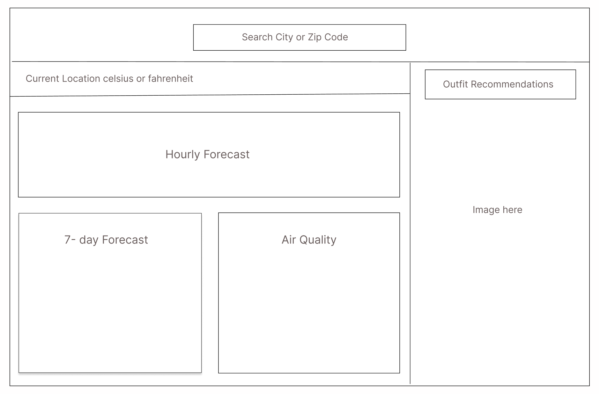

# TemperFit

There is no such thing as bad weather, only bad clothing.

## Background

I find it very difficult to decide what to wear everyday. It is hard to figure out what to choose especially in the morning, when you're still warm in bed.
I always google outfit guides for the current temperature and compare using the weather app in the morning.
The goal of this webpage is to help people avoid dressing  inappropriately for the current weather.

## Functionality & MVPs

- In TemperFit, users will be able to:

    - Select either their current location or any other location they may be interested in. 
    - Look at a 7-day weekly forecast.
    - See outfit recommendations based on the average temperature in the area.
    - Save their home address.
    - Switch celsius to fahrenheit.

- In addition, this project will include:

    - {2-4 other aspects of your project, including instructions & README }
    - { other aspect of project }
    - { other aspect of project }

## Wireframes

## Technologies, Libraries, APIs

This project was be implemented with the following technologies

- Global weather forecast API
    - <https://open-meteo.com/en/docs>
- Geolocation API for location
    - <https://w3c.github.io/geolocation-api/>
- add more later

